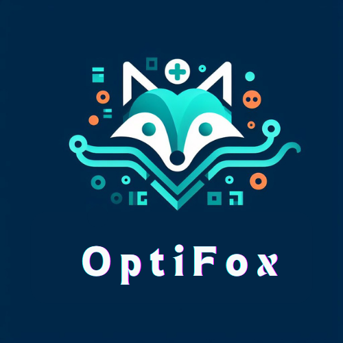
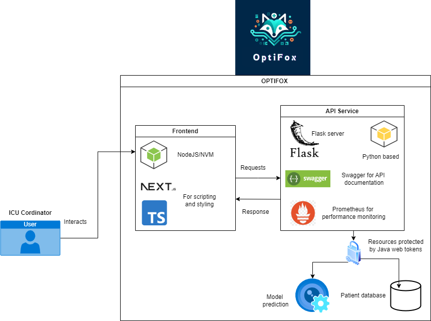
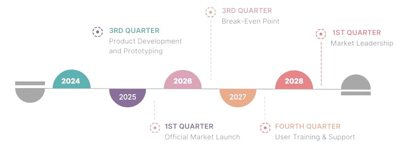
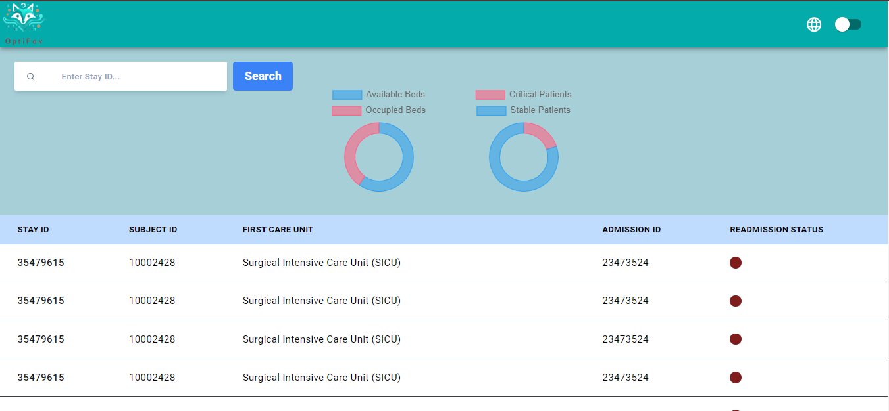
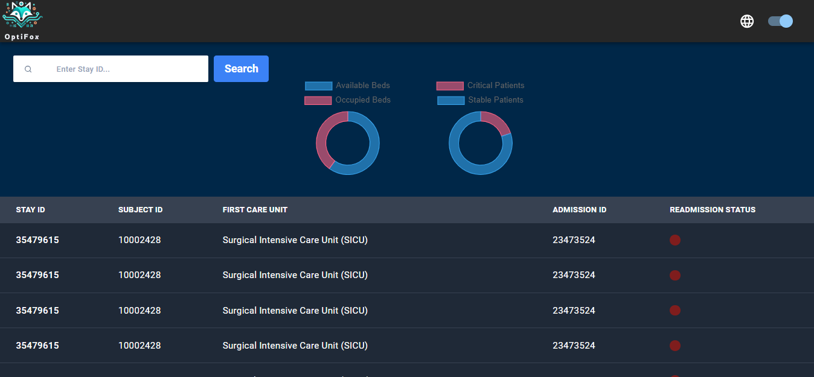
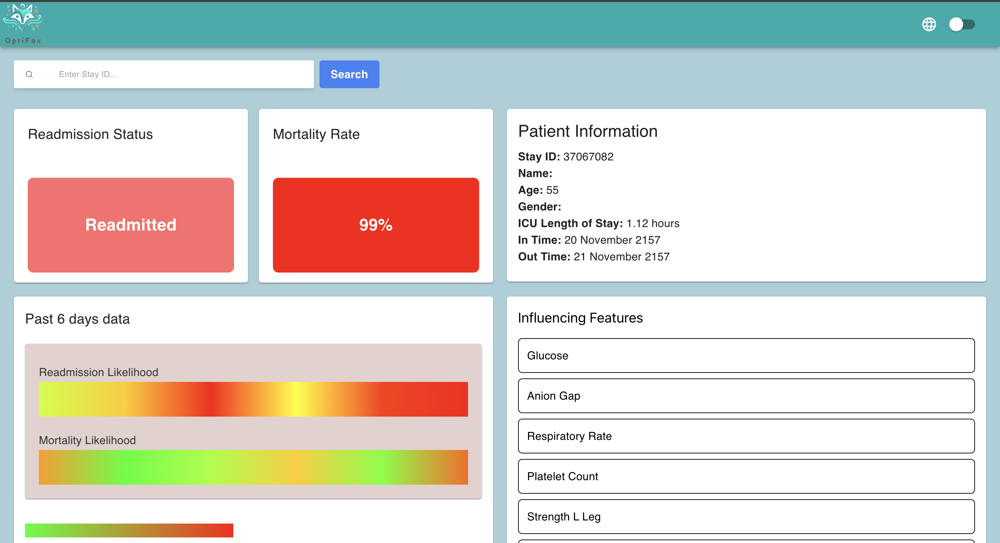
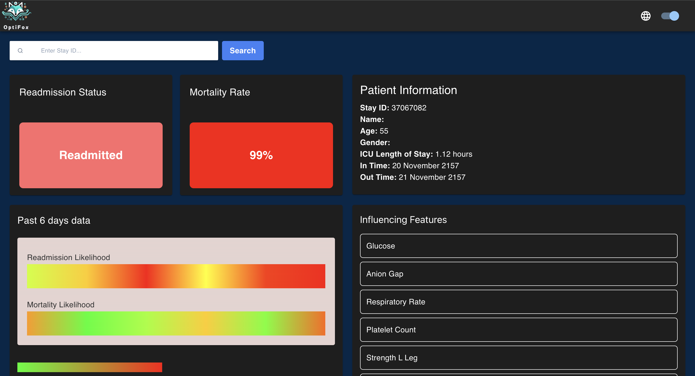
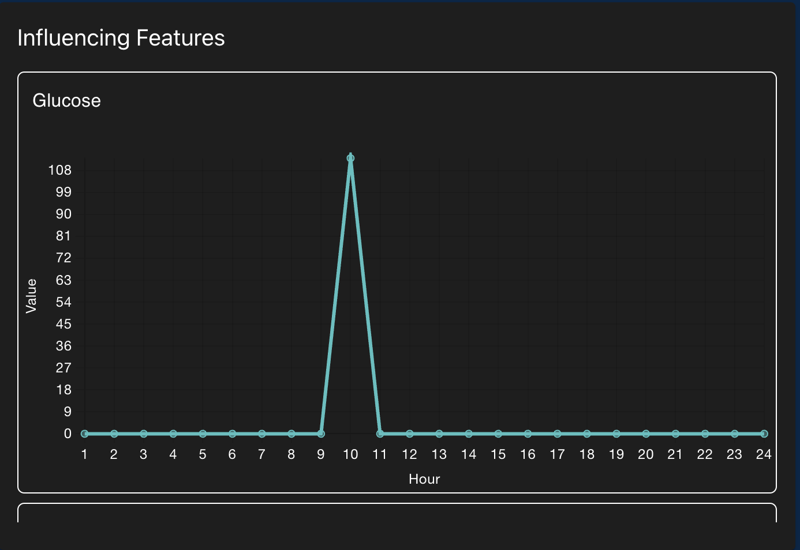

<!-- PROJECT LOGO -->
<br />
<div align="center">
    
  </a>

<h3 align="center">OptiFox</h3>

  <p align="left">
    OptiFox is aims to be a  real-time web application designed to predict readmissison rate, mortality risk,optimize ICU bed allocation and enhance patient care. By displaying current ICU patients and their readmission statuses, OptiFox provides critical insights into the factors influencing readmission rates. The system features a 24-hour graph for each patient, enabling doctors to focus on key factors affecting patient outcomes. This data-driven approach empowers healthcare providers to make informed decisions, ensuring efficient resource management and improved patient care in critical settings. Additionally, OptiFox’s comprehensive analysis aids in identifying trends and patterns, allowing for proactive adjustments to treatment plans. Ultimately, OptiFox aims to elevate the standard of care in ICUs through precise and actionable insights.

  </p>
</div>


<!-- TABLE OF CONTENTS -->
<details>
  <summary>Table of Contents</summary>
  <ol>

    <li><a href="#getting-started">Getting Started</a></li>
    <li><a href="#project-structure">Project Structure</a></li>
    <li><a href="#api">API</a></li>
    <li><a href="#roadmap">Roadmap</a></li>
    <li><a href="#usage">Usage</a></li>
    <li><a href="#first-release">First release</a></li>
    <li><a href="#license">License</a></li>
    <li><a href="#acknowledgments">Acknowledgments</a></li>
  </ol>
</details>


### Built With

*  Python 3.10
*  NodeJS
*  NextJs
*  TypeScript
*  <3


<!-- GETTING STARTED -->

## Getting started



### Prerequisites

Before you begin, ensure you have the following installed:

Node.js: [Download and install from Node.js official website](https://nodejs.org/en)
Node Version Manager (nvm): [Installation guide](https://github.com/nvm-sh/nvm)

### Installation

1. Navigate to the Frontend Directory
 Open a terminal and navigate to the frontend directory:

 ```
 cd frontendUI/my-app

```

2. Setup the Server
 Proceed to server.py located under 'Code' folder. This file contains the OptiFox server-side code. Run the server.py file.


3. Set Node Version
 Use nvm to switch to the correct Node.js version:
```nvm use 18.17.0```

4. Start the Development Server
 Initiate the development server with the following command:
```
 npm run dev
```

5. Access the Application
After successfully starting the server, the following output will be something as follows:
```
▲ Next.js 14.2.4
 - Local: http://localhost:3000

```

Visit the base URL and you will be redirected to the log in page.

- To visit the landing page, extend the base URL with : '/patients'

- To visit the specific patient's page, exted the base URL with :  '/patients/{patient_id}'

<!-- Project Structure -->
## Project Structure
Give a brief overview of the project's structure by visualising the (sub-)folder structure and how files interact with each other.

```
Xitaso/
├── code/
│   ├── __pycache__/
│   ├── static/
│   ├── templates/
│   ├── __init__.py
│   ├── patient_info.py
│   ├── readmission_rate.py
│   ├── security.py
│   ├── server.py
│   ├── swagger.yml
│   └── utils.py
├── data/
├── models/
├── references/
├── reports/
├── src/
├── tests/
│   └── test_server.py
├── requirements.txt
├── .devcontainer/
├── Dockerfile
└── README.md

```

- **code/**: Directory for the project's source code.
    - **server.py**: Contains the Flask application code.
    - **templates/**: Directory for HTML templates.
    - **static/**: Directory for static files like CSS and JavaScript.
        - **css/**: CSS files for styling.
        - **js/**: JavaScript files for interactivity.
- **data/**: Directory for data files used in the project (MIMIC IV).
- **models/**: Directory for machine learning models or other saved models.
- **references/**: Directory for reference materials or documentation.
- **reports/**: Directory for project reports or documentation.
- **src/**: Directory for any additional source code or libraries to produce preprocessing data.
- **tests/**: Directory for test cases.
    - **test_server.py**: Test cases for the Flask application.
- **requirements.txt**: File containing dependencies required to run the project.
- **.devcontainer/**: Directory containing configuration files for development container settings.
- **Dockerfile**: File containing instructions to build a Docker image for the project.
- **README.md**: Documentation for the project.

### Flask API

This repository contains a Flask API service with interactive documentation provided by Swagger. Swagger offers a user-friendly interface to explore the available routes, view expected inputs and outputs, and test the endpoints directly from your browser.

**Features**:
- Interactive API Documentation: Easily understand the API structure and functionality through the Swagger UI.
- Live Testing: Send requests and view responses in real-time, making it simple to experiment with and integrate the API.

_Find the detailed description of all the APIs and "how-to" guide here [API Manual](Code/static/API_manual.pdf)
<!-- ROAD MAP -->
## Project Road map




<!-- USAGE EXAMPLES -->

## Usage

### Landing Page

If you follow the instructions as detailed above, you should ideally end up with the below 'landing page' here you can get an an overall top level view of all the patients currently active, here you can see the bed availability and the probability of readmission for every patient, the red color indicates that the patient is high risk, and you navigate to the specific patient by clicking on it.

#### Light Mode



The light mode is designed in such a way that it is made possible for the staff working in the early hours of the day to see more clearly in the tablet, one more thing to notiece is the heatmap that allows to see how the patient specific stastic (risk) is progressing as days pass, this was done to allow the staff in the ICU to take long term data into consideration whilst making triaging decisions.

#### Dark Mode



There is also a toggle option to see the same in dark mode, this is kept in mind for staff that works late hours, and the colors are carefully picked in away that it wont strain their eyes out when working with optifox products : )

### Patient Page

Once logged in, users are directed to the patient page, where they can see patient specific information, like the basic information of the patient, their predicted risk of course and also the features that directly influenced the model.

#### Light Mode



#### Dark Mode



The ICU cordinator ideally now can take a look at the features and make inferences to perhaps treat the patient better, although this part needs more detailed study to find the correlation between the model features and actual patient condition, this can only be refined once we finally start working with actual data.

### Features Page

When you click on any feature, it opens a plot for the past 24 hours worth of information as shown below!




Key Features:

1. Developed and coded the entire proposed application.
2. Front end displays striking visualizations and the APIs are robust both in latency and security

<!-- LICENSE -->

## License

Distributed under the MIT License. 

<!-- ACKNOWLEDGMENTS -->
## Acknowledgments
Use this space to list resources you find helpful and would like to give credit to.
* [1]. Daniel McIntyre, B., & Clara K. Chow, M. P. (2020). Waiting Time as an Indicator for
Health Services Under Strain: A Narrative Review
* [2]. DESTATIS Statisches Bundesamt. (2023). Retrieved from
https://www.destatis.de/EN/Themes/Society-Environment/Health/Health-Expenditure/
Tables/sources-of-funding.html
* [3]. Philipp G. H. Metnitz, R. P.-R. (2005). SAPS 3 From evaluation of the patient to
evaluation of the intensive care unit. Part 1: Objectives, methods and cohort
description.
<p align="right">(<a href="#readme-top">back to top</a>)</p>

<!-- Contributions -->

## Contributions

To contribute to this repository, please fork the project, make your changes in a separate branch, and submit a pull request for review. Be sure to follow proper git hygiene.
